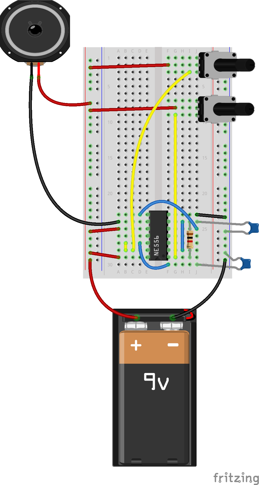
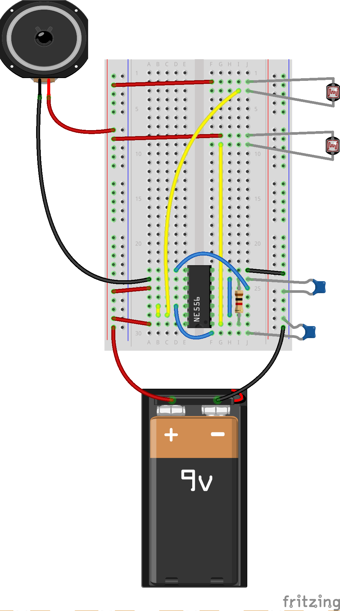

# Atari Punk Console

The Atari Punk Console (APC) is a simple circuit to build that has a lot of expressive potential. It's a way to make soemthing noisy with electronics that you can enjoy and not worry about scewing up much during the build. In fact, it may make weirder sounds this way.

It uses [the 555 timer](https://www.dropbox.com/s/0zklerplnu7isn0/555_from_make.pdf?dl=0) to generate tones.

