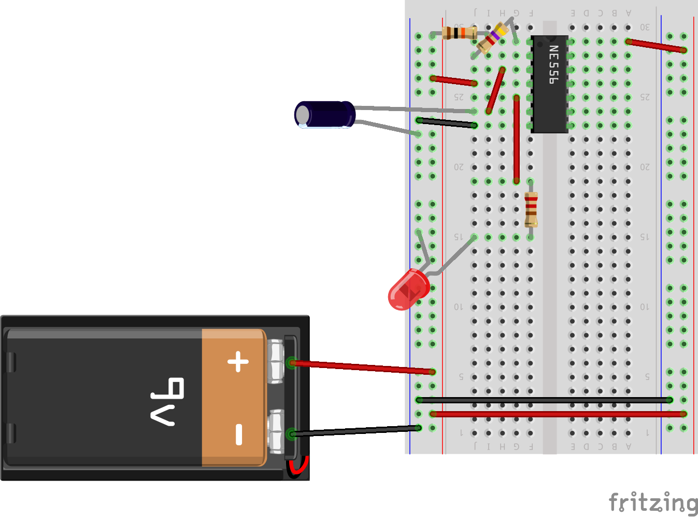

# 555 flasher circuit

This simple circuit uses a capacitor and some resistors to flash an LED at a regular interval. You can also hook uop a speaker or piezo to make noise at the same time

It uses [the 555 timer](https://www.dropbox.com/s/0zklerplnu7isn0/555_from_make.pdf?dl=0) to generate the pulses. We're using a 556 timer, which is really 2 555s in one package.

