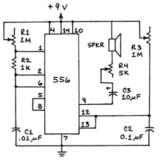

# Atari Punk Console

The Atari Punk Console (APC) is a simple circuit to build that has a lot of expressive potential. It's a way to make soemthing noisy with electronics that you can enjoy and not worry about too much.

