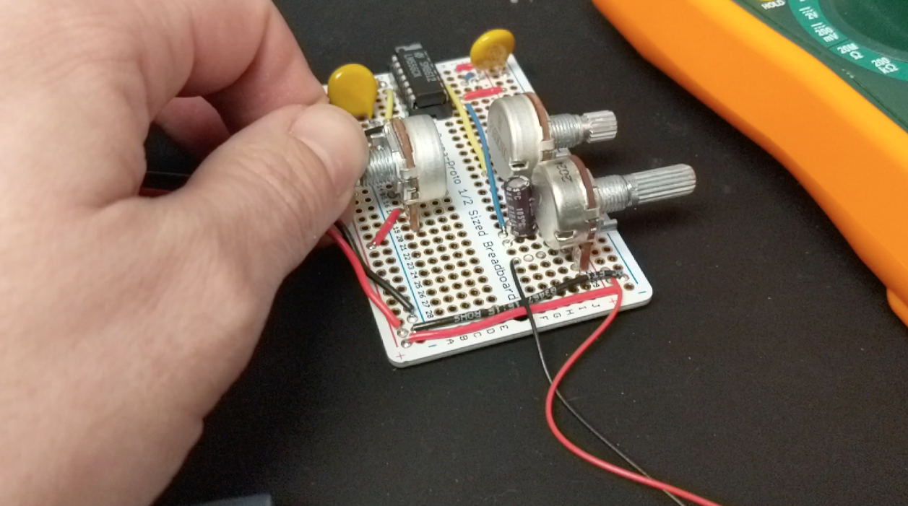

# Atari Punk Console

The Atari Punk Console uses either two [555 timer chips](https://www.ti.com/lit/ds/symlink/lm555.pdf), or one 556. It was originally called a “stepped tone generator”. You have an upcoming exhibition that needs to include an APC. You have a schematic and some video showing off the finished piece. The curator is pretty hip though, and believes that you should have some leeway in the interpretation of the piece.

Working with the components you have in hand, recreate the circuit as described in the documentation below on a breadboard, then move it to a more finished copper-clad board, soldering he pieces into place.

The schematic you were provided with follows, along with some video documentation.

Once you have built your circuit on a breadboard or soldered it onto your copper plated board, post it with some video to the #apc channel in slack.

Need some help building the circuit? [Here’s an illustration of the breadboard layout](https://tbm.idm.hosting.nyu.edu/wp-content/uploads/2021/01/APC.png)

Once you have build the circuit on the breadboard and its making some noise, [click through to these videos which demonstrate how to move to the copper board, and provide some hints on how to ‘personalize’ the circuit](https://vimeo.com/showcase/8018678)
