# 555 Timer Monophonic Organ

Using a 555 chip, you're going to build an organ that will produce a different tone based off the button that is pressed.

## The finished product
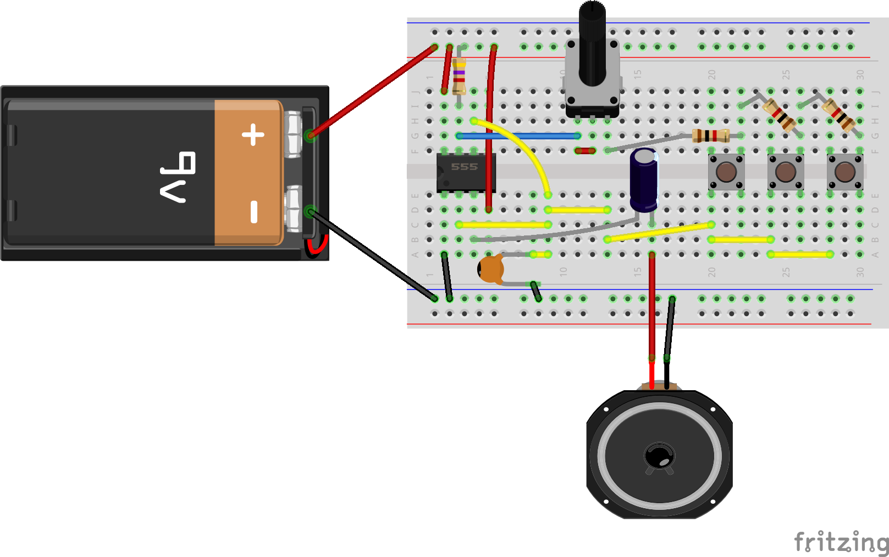

### Step 1 - the Breadboard
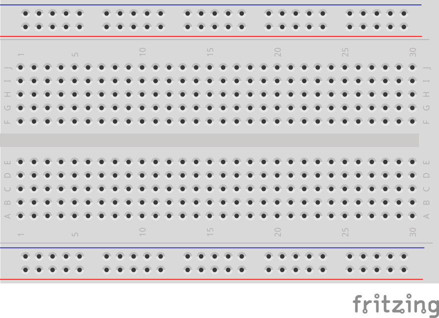

### Step 2 - the IC
Place the IC in the board with the dot facing the closest edge of the board
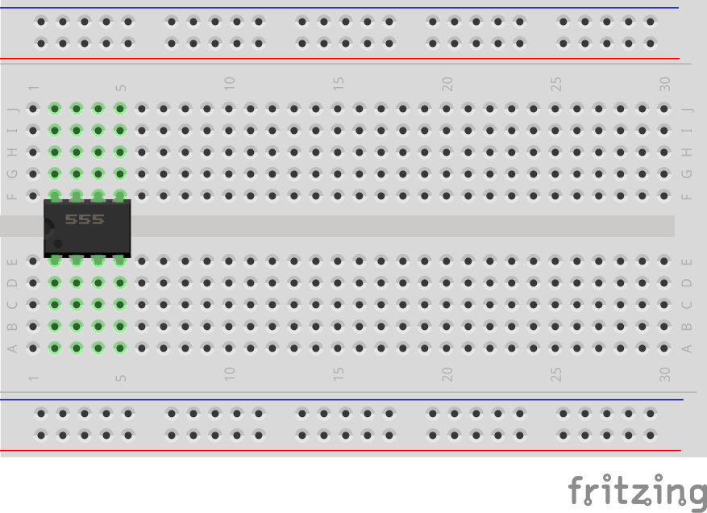

### Step 3 - power and ground
Connect pin 1 to ground and pin 8 to power
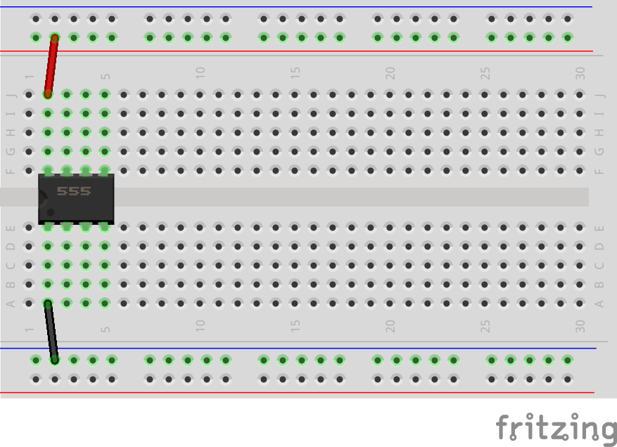

### Step 4 - finish the chip wiring
Connect pin 7 to power throigh a 4.7k ohm resistor, and connect pin 4 to power
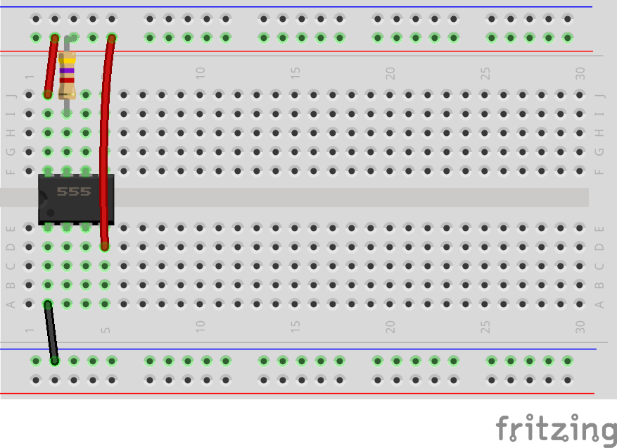

### Step 5 - pull out a lead for a pot
bring a wire out from pin 7
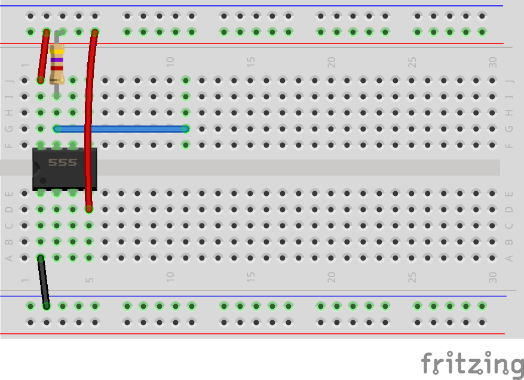

### Step 6 - wire the pot 
add a 100k pot so one end connects to pin 7. bridge the center pin and the terminal connected to pin 7
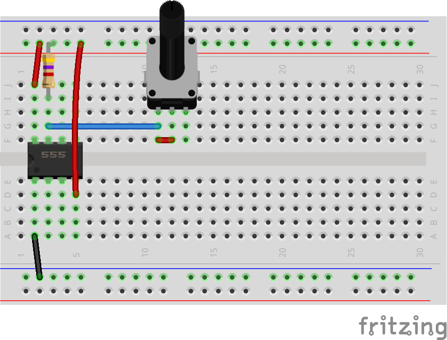

### Step 7 - add some switches 
Add your switches to the far end of the bb
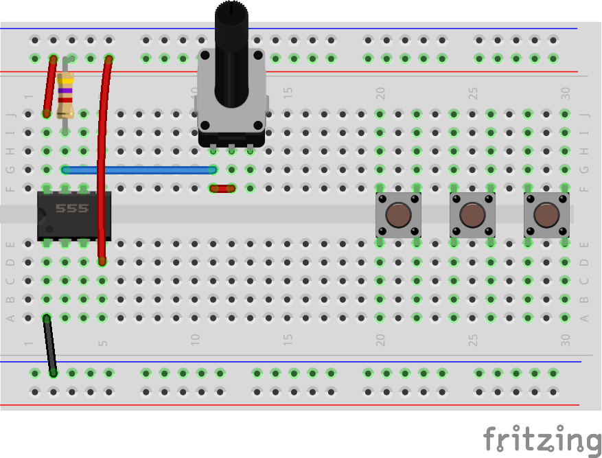

### Step 8 - make a resistor ladder 
Add 1.1k rersistors in series with each other connected to one terminal of the pot, ending with the termonal of one of the switches. Each resistor shpuld connect to two switches
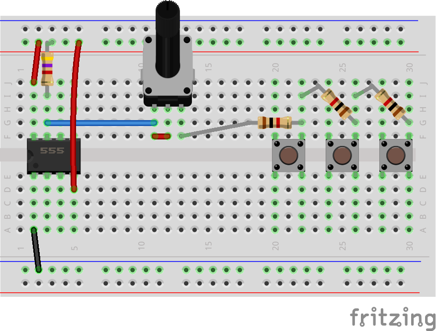

### Step 9 - connnect pins 2 and 6 to the switches
connect pins 2 and 6 to the switches in parallel
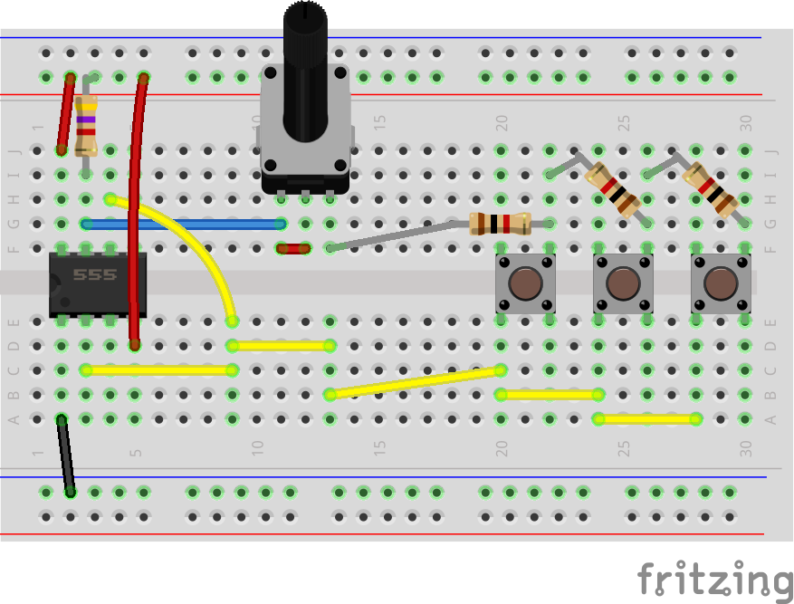

### Step 10 - add the capacitors
Connect a small ceramic cap (labeled 104) to ground and the junction of pins 2, 6, and the switches. Connect a polarized 100uf capacitor to the circuit with the anode (long leg) connected to pin 3 of the 555 and the other pin in an otherwise empty column 
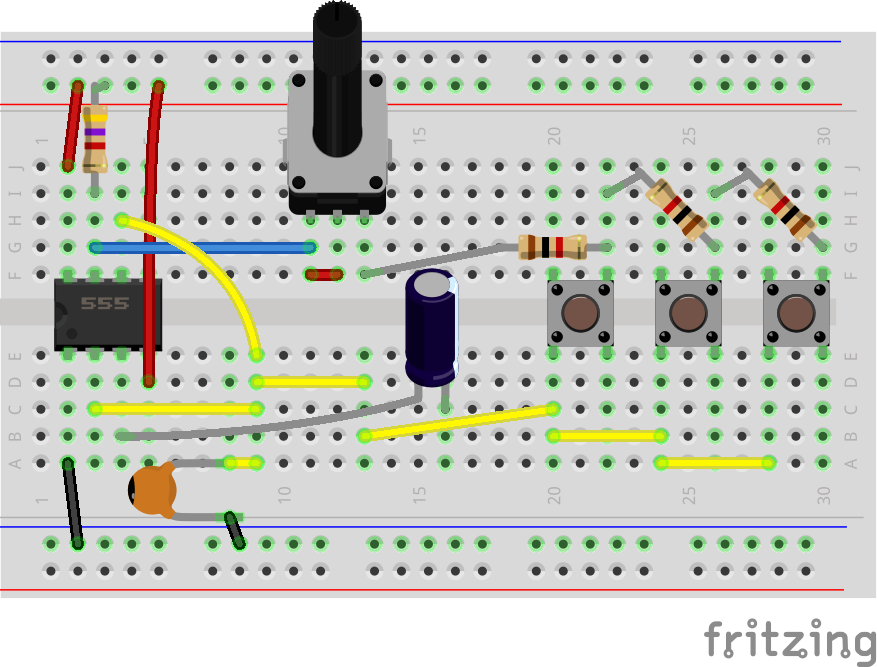

### Step 10 - add the speaker!
Connect one end of the speaker to the pin with the polarized capacitor, and the other end to ground
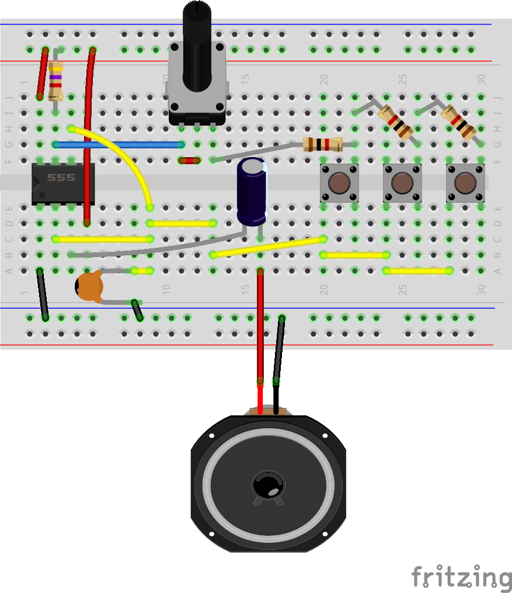

### Step 11 - add the power and press play!
Connect your battery to the bus rows and make some noise
