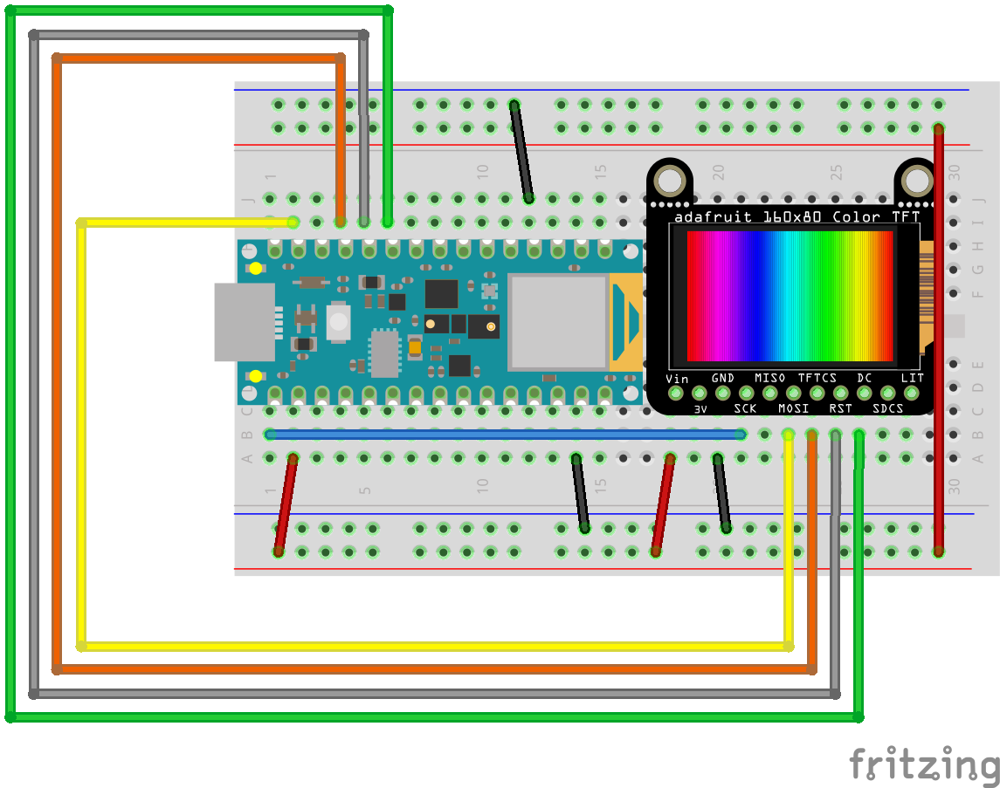

# TFT Screens & microcontrollers


## What is a TFT screeen anyhow?
A TFT LCD is a thin-film-transistor liquid-crystal display.  They are ubiquitous and used in just about every device with a high resolution display. 


Effectively, an LCD panel is a sandwich of liquid crystals (a funny type of matter that is, as the name implies, liquid and crystaline) and ploarized screens. When an electric current is passed through the crystals, they reorient themselves. By applying a variable voltage to each pixel element, the opacity of the pixel appears to change. When using this in conjunction with the various polarizing screens and color filters, every R/G/B triplet creates a single visual pixel. When these pixels are mashed up closely in a dense screen, we get something that can display an image (when the right data is sent to the pixels).
Because this technology relies on polarized filters, with less expensive screens, when viewd from side angles they will often seem to lose focus, look washed out, have low contrast, or seem to disappear. 

## How do you use one?
While these are the same technology driving your laptop, tv, or phone screen, you don't need a high end device to operate one. While a lot of processing power goes into makimng the graphics o htese devoxes look nice and smooth, we can use the communication capabilities of microcontrollers to display images. The screen are not generally driven directly by microcontrollers, it's a ton of wiring and relies on highly specific timing and commands. Instead the micro communicates with an intermediary IC that takes data from the microcontroller and translates those commands to the signals that rapidly turn the pixel elements on and off. 
These ICs sometimes have specific functionality baked into them for dealing with fonts, images, color, etc. The microcontroller's duty here is to send commands to the driver chip, which then does the dirty work of sending the voltage to the screen elements, which ultimatel displays an image.
An example of a [TFT driver chip is the RA8875](https://www.raio.com.tw/en/RA8875.html). This chip has enough capacity to drive a TFT screen with greater resolution than an old-school NTSC television. Our Arduinios are too pokey to show photorealistic animation, but it is possibkel to do simple interactive graphics and text.

## When would you use one?
TFT screens are useful in a number of applications for embedded devices — displaying diagnostic information, sensor readings, debugging, showing images, acting as locations of graphic information... There's a lot of flexibility there. They come in handy anytime you need a project that could use a screen, but you donlt want to attach a full-ass computer just for display purposes.
I've seen them in IoT devices, smart home devices, flip phones, [belt buckles](https://www.instructables.com/The-Asteroid-Belt/), [shoes](http://www.theaphroditeproject.tv/), all kinds of crazy places.

## Gimme a demo!


For this demo, I'm using an [Adafruit 1.14" 240x135 Color TFT Breakout LCD Display](https://www.adafruit.com/product/4383). This one is kinda nice as it not only has pretty vibrant color and a decent resolution, it also has a micro SD card reader attached, so you can show bitmap images on there too.
The screen has a 250x135 resolution, and is driven by a [ST7789 chip](https://www.rhydolabz.com/documents/33/ST7789.pdf). The chip communicates via SPI (Serial Perihiperal Interface) and requires power, ground, a SPI clock, COPI, CS, DC, and reset connection.

In this example, I'm using the values from the Nano 33 BLE's built-in accelerometer to determine the position of a line drawn on the screen. This line will appear to stay foxed to the horizion, even as the board rotates on the x-axis. The accelerometer x-axis value is also printed to the screen. This example relies on a number of external libraries - [SPI](https://www.arduino.cc/reference/en/language/functions/communication/spi/), [Adafruit_GFX](https://learn.adafruit.com/adafruit-gfx-graphics-library/) (to leverage the graphics libray), [Adafruit_ST7789](https://github.com/adafruit/Adafruit-ST7735-Library) (to communicate with the screen driver), and [Arduino_LSM9DS1](https://www.arduino.cc/reference/en/libraries/arduino_lsm9ds1/) (to communicate with the accelerometer).

The graphics library is pretty handy, as it has calls for basic lines, points, circles, rectangles, as well as fonts and color. 

Example code follows with a wiring diagram below.

```
// uses the nano's accelerometer values to calculate
// a line drawn on a TFT screen that always appears
// to be fixed at the horizion

#include <Adafruit_GFX.h>     // Adafruit graphics library
#include <Adafruit_ST7789.h>  // Hardware-specific library for ST7789
#include <SPI.h>              // SPI lib
#include <Arduino_LSM9DS1.h>  // accel lib

// set up the SPI pins
#define TFT_CS 10
#define TFT_RST 9
#define TFT_DC 8
// initialize the tft library
Adafruit_ST7789 tft = Adafruit_ST7789(TFT_CS, TFT_DC, TFT_RST);

// horizontal start and end positions
int yStart = 135 / 2;
int yEnd = 135 / 2;

// previous start and end positions
int oldEndY;
int oldStartY;

float oldx = 0.0;

void setup(void) {

  tft.init(135, 240);  // Init ST7789 240x135
  tft.setRotation(1);  // rotate drawing axis

  if (!IMU.begin()) {  // init accelrometer, throw error if issue
    while (1)
      ;
  }
  // fixes SPI speed issue
  // tft.setSPISpeed(40000000);
  // black background
  tft.fillScreen(ST77XX_BLACK);
}

void loop() {
  float x, y, z;  // accel returns a float -1.0 to 10.
  int xi;         // an int version of the accel value

  // if there's data from the accel
  if (IMU.accelerationAvailable()) {
    IMU.readAcceleration(x, y, z);  // read the value and store in the vars
    xi = x * 100;                   // calculate an int version of the values
  }
  // figure out the y start & end position for the the line
  // map the value to the height on either side of the TFT
  yStart = map(xi, 100, -100, 135, 0);
  yEnd = map(xi, 100, -100, 0, 135);

  // if there is a change
  // erase an old line by drawing over it in black
  // draw the new line. this is retained until there is a change
  if (oldStartY != yStart || oldEndY != yEnd) {
    tft.drawLine(0, oldStartY, 240, oldEndY, ST77XX_BLACK);
    tft.drawLine(0, yStart, 240, yEnd, ST77XX_MAGENTA);
  }

  // update the end x/y positions
  oldStartY = yStart;
  oldEndY = yEnd;

  // print the accel value to the screen
  tft.setTextSize(2);
  tft.setCursor(0, 0);
  tft.setTextColor(ST77XX_BLACK);
  tft.print(oldx);
  tft.setCursor(0, 0);
  tft.setTextColor(ST77XX_MAGENTA);
  tft.print(x);
  // update val
  oldx = x;
}
```


